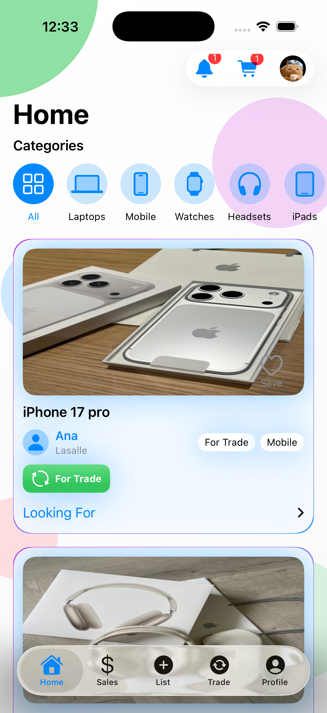
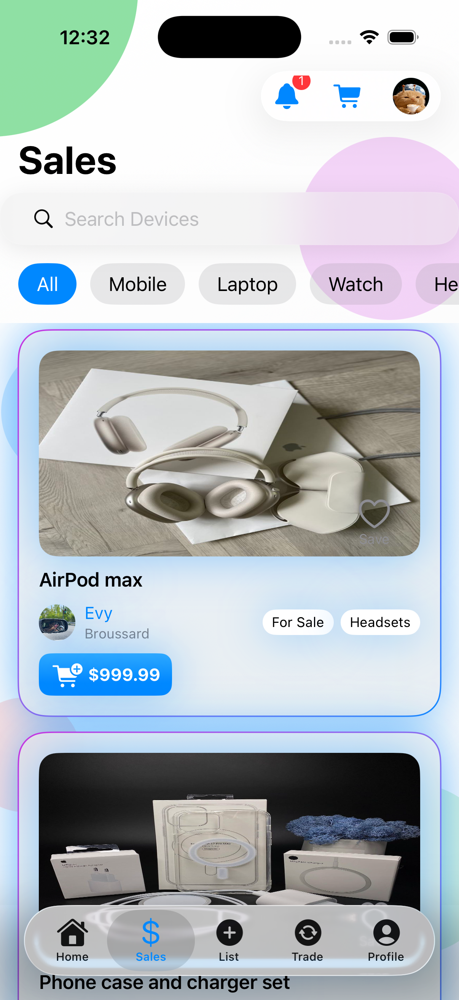
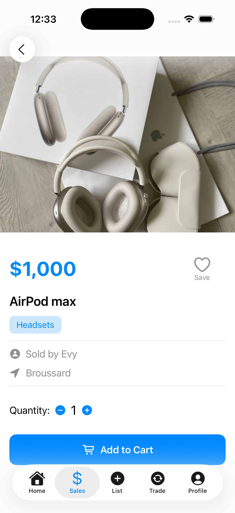
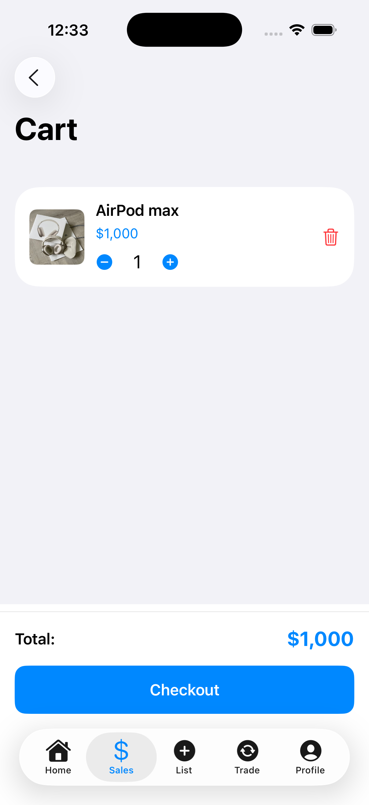
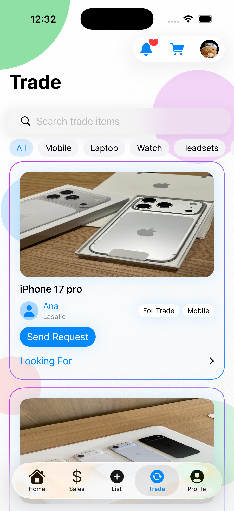
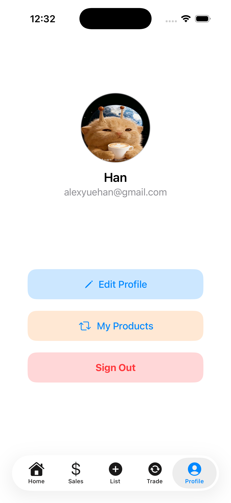

# PlugTrade

An iOS app built with SwiftUI + Firebase that allows users to **buy, sell, and trade** tech products.

## App Screenshots

### Home

### Sales Flow
| Sales | Item Detail | Cart |
|-------|-------------|------|
|  |  |  |

### Post New Item

### Trade Flow
| Trade | Proposal |
|-------|----------|
|  |  |

### Profile

---

## Key Features

### Buy & Sell
- Browse products by category  
- Product detail view  
- Add to cart + checkout flow  

### Trade System
- Browse trade listings  
- Send trade proposals  
- Accept / reject requests  

### User System
- Firebase authentication  
- Profile page & profile edit  
- View your products (for sale & for trade)

### Notifications
- Real-time updates via Firestore snapshots  
- Unread notification badge  

---

## Tech Stack

- **SwiftUI**
- **Firebase Authentication**
- **Cloud Firestore**
- **Firebase Storage**
- **MVVM Architecture**

---

## Run the App

1. Clone the repo  
2. Add your `GoogleService-Info.plist` to the project  
3. Open in Xcode  
4. Run on iOS 15+  
5. All Firebase services initialize automatically  

---

## Contributors
- Shaquille O Neil  
- Evelyne  
- Han  

---

